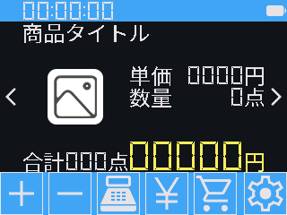
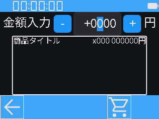
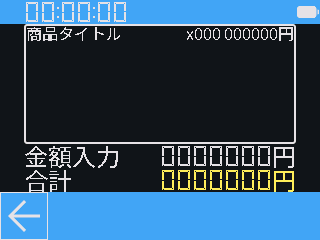
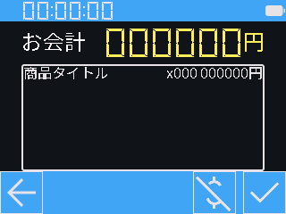
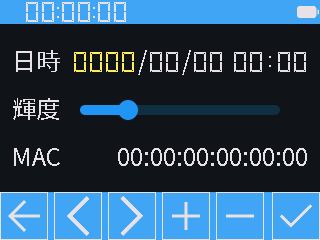

# M5Stack 使用 同人誌即売会用レジ端末 (QR Code POS Terminal for M5Stack)

## 概要

コミックマーケット等、同人誌即売会での会計処理を念頭に置いて開発したレジ端末のファームウェア。
ハードウェアは M5Stack Core2 を使用し、はんだ付けを伴う組み立てを必要としない。

M5Stack Faces を使用する拙作 [m5stack-sokubai-pos](https://github.com/nnm-t/m5stack-sokubai-pos) は2019年開発で設計が古くなっており、パーツの入手も難しくなってきたので、2代目として新規に設計した。

### 機能

- M5Stack のディスプレイに搭載されたタッチパネルですべての操作が可能
  - HMI Module のエンコーダとスイッチでの操作も可能
- 登録済み商品のカウント・売上記録
  - 商品データは JSON 形式で読み込む
  - サムネイル画像の表示が可能
- バーコード/QRコードを読み取り、登録済み商品をカウント
- 未登録商品の金額入力
- 登録済み商品・金額入力それぞれの売上一覧の表示
  - 売上データは JSON 形式で保存
  - 売上データに時刻を付加して CSV 形式での書き出しにも対応
- 時刻表示・設定、バッテリ残量表示

## 商品データ

使用にあたり、定められた仕様で記述した `goods.json` と `sales.json` の2つの JSON ファイルを MicroSD カードのルートディレクトリにコピーし、カードを M5Stack のカードスロットに装着する必要がある。

### `goods.json` ([サンプル](https://github.com/nnm-t/m5-qrcode-pos/blob/master/json/goods.json))

```json
{
    "goods": [
        {
            "name": "商品0",
            "image_path": "/image_0.bmp",
            "price": 500,
            "code": "9999999999999"
        },
        {
            "name": "商品1",
            "image_path": "/image_1.bmp",
            "price": 1000,
            "code": "9999999999999"
        }
    ]
}
```

- `goods`: 商品 (配列形式)
  - `name`: 商品名
  - `image_path`: サムネイル画像 (120 x 120 Windows Bitmap) のパス
  - `price`: 価格 (円)
  - `code`: QRコードリーダで読み取った時の値 (使用しなければ適当な文字列で埋める)

### `sales.json` ([サンプル](https://github.com/nnm-t/m5-qrcode-pos/blob/master/json/sales.json))

```json
{
    "goods": [
        0,
        0
    ],
    "amounts": {}
}
```

- `goods`: 商品の売上 (配列形式)
  - 値の要素数は `goods.json` での商品データの要素数と同一にする
- `amounts`: 金額入力の売上
  - 中括弧の中は空で構わない

## 対応機種

日本国内では[スイッチサイエンス](https://www.switch-science.com/)等で正規ルート品を入手可能。

- [M5Stack Core2](https://docs.m5stack.com/ja/core/core2)
  - 基本構成が同一の [Core2 v1.1](https://docs.m5stack.com/ja/core/Core2%20v1.1)/[Core2 For AWS](https://docs.m5stack.com/ja/core/core2_for_aws) 等にも対応
  - [CoreS3](https://docs.m5stack.com/ja/core/CoreS3)/[CoreS3 SE](https://docs.m5stack.com/ja/core/M5CoreS3%20SE)/[CoreS3 Lite](https://docs.m5stack.com/ja/core/CoreS3-Lite) 等での動作も考慮 (未確認)
- [Module HMI](https://docs.m5stack.com/ja/module/HMI%20Module) (オプション)
- [Moodule13.2 QRCode](https://docs.m5stack.com/ja/module/Module13.2_QRCode) (オプション)
- [Base AAA](https://docs.m5stack.com/ja/base/base_aaa) (オプション)
  - Base をこれに交換すると単4電池4本で長時間駆動が可能
  - CoreS3 シリーズでは満充電でも起動しないので、起動時のみ USB から給電する

## 開発環境

大人の事情で PlatformIO の ESP32 対応がストップしているため pioarduino を使用。
Visual Studio Code では [pioarduino IDE](https://marketplace.visualstudio.com/items?itemName=pioarduino.pioarduino-ide) をインストールして環境構築できる。

- pioarduino: [platform-espressif32](https://github.com/pioarduino/platform-espressif32)
  - Arduino Platform
  - v0.1 時点で Arduino 3.3.7 + ESP-IDF 5.5.2 でビルド

### `lv_conf.h` の設定

本リポジトリに含まれない `.pio/libdeps/m5stack-core2/lvgl/lv_conf.h` はユーザ自身で編集する。
なお `m5stack-core2` の部分は使用するマイコンボードによって変わる。

まずは `.pio/libdeps/m5stack-core2/lvgl/lv_conf_template.h` を同一ディレクトリ上に複製し `lv_conf.h` にリネームする。

LVGL 9.4 では 15行目にある `#if` ディレクティブの値を `0` から `1` に変更する。

```c
#if 1
```

LVGL 9.4 では 935, 941, 945 行目にある、画像デコーダに関する `#define` を `0` から `1` に変更して有効化する。

```c
#define LV_USE_LODEPNG 1

#define LV_USE_BMP 1

#define LV_USE_TJPGD 1
```

キャッシュ機能を持たせたファイルシステムを独自に実装しているので `LV_USE_FS_ARDUINO_SD` (LVGL 9.4 では 917 行目) 等を変更する必要はない。

## 操作説明

すべての操作はM5Stackのタッチパネルで行うことができる。一部の操作は、Module HMIを装着しているとそちらのエンコーダやボタンでも行える。
すべての画面で、上部に現在時刻とバッテリ残量が表示される。USBケーブルを接続した外部給電の状態ではバッテリ残量が正しく表示されないが、故障ではない。

### 商品選択



起動すると最初にこの画面が表示される。
画面中央には**商品のサムネイル・単価・数量**が、その下には確定前の(金額入力を含めた)**全商品の数量・価格**が表示される。
数量は-99～99点まで入力できる。確定後の会計ミスを取り消す機能はないので、マイナスの数量を入力して代用する。
M5StackにModule 13.2 QRを装着している場合、バーコード/QRコードを読み取って、読み取り値と同じ値が商品データにあれば、その商品の数量を加算することができる。
ここで**数量を入力した時点では会計は確定されない**。後述の会計画面にて確定操作を行う。


-	「＜」 (またはModule HMIエンコーダ): 前の商品へ移動
- 「＞」 (またはModule HMIエンコーダ): 次の商品へ移動
- 「＋」 (またはModule HMI Aボタン): 表示中の商品の数量を増やす
- 「‐」 (またはModule HMI Bボタン): 表示中の商品の数量を減らす
- レジマーク: 売上一覧へ移動
-	「￥」: 金額入力へ移動
-	カゴマーク: 会計画面へ移動
-	歯車マーク: 設定へ移動
-	サムネイル画像長押し: バーコード読み取り (Module13.2 QR装着時)
-	合計金額長押し: 全商品の数量リセット

### 金額入力



**商品データに登録されていない会計**を取り扱う場合や、投げ銭・値引きがあった場合にも使用する。金額は-9900～9900円まで入力でき、100円単位での入力を想定している。
中央には確定済みの会計記録を金額別に表形式で表示。表はタッチ操作でスクロールする。
商品選択と同様に、この画面で**金額を入力した段階では会計は確定されない**ので、後述の会計画面にて確定操作を行う。

-	数値ボックス (またはModule HMI A/Bボタン): 金額を変更する桁を選ぶ
-	「＋」 (またはModule HMIエンコーダ): 選択した桁の値を増やす
-	「‐」 (またはModule HMIエンコーダ): 選択した桁の値を減らす
-	「←」: 商品選択へ移動
-	カゴマーク: 会計画面へ移動

### 売上一覧



確定済みの**各商品の品名・売上数量・小計**を表形式で表示し、併せて**金額入力の合計額**と、**全商品および金額入力の合計額**を表示する。表はタッチ操作でスクロールする。
この画面は閲覧のみで、入力操作は無い。

-	「←」: 商品選択へ移動

### 会計画面



前述の商品選択・金額入力の画面で入力した売上を**確定**させる画面。
上部の「お会計」には**確定前の全商品・金額入力の合計額**が表示され、中央部には**確定前の各商品の品名・数量・小計**を表形式で表示する。表はタッチ操作でスクロールする。
確定操作を行った時点でMicroSDカードに売上データ(JSON・CSV形式)が**保存**され、前述の売上一覧にも反映される。MicroSDカードに保存された売上データは、当然ながらM5Stackの電源を切っても保持される。

-	「←」: 商品選択へ移動
-	$に斜線マーク: 「お会計」で表示の合計金額を金額入力としてマイナスした上で、売上を確定
-	商品を無料で渡した時などに使う
-	チェックマーク: 売上を確定

### 設定



各種設定を行う。
「日時」では**時刻設定**を行う。売上確定時にCSVデータに時刻情報を付加するので、必ず設定してもらいたい。設定値はM5Stackの内蔵RTC(時計IC)に保存され、電源を切っても保持されるが、内蔵RTCは長時間電源を切っていると設定値が失われるようである。
「輝度」では**液晶バックライトの輝度**を設定する。輝度設定はデータとして保存していないので、電源を切ると元の設定値に戻る。
「MAC」では、M5Stackに搭載のESP32チップに内蔵された、**無線LANのMACアドレス**を表示する。本プログラムでは使用しないが、個体識別等に役立ててほしい。

-	輝度スライダー: タッチ+スライドで輝度変更
-	「←」: 時刻設定を破棄して、商品選択へ移動
-	「＜」 (または時計の桁をタッチ): 時刻の選択中の桁を左へ移動
-	「＞」 (または時計の桁をタッチ): 時刻の選択中の桁を右へ移動
-	「＋」 (またはModule HMIエンコーダ): 時刻の選択中の値を加算
-	「‐」 (またはModule HMIエンコーダ): 時刻の選択中の値を減算
-	チェックマーク: 時刻設定を反映して、商品選択へ移動


## ライセンス

- [M5Unified](https://github.com/m5stack/M5Unified): [MIT](https://github.com/m5stack/M5Unified/blob/master/LICENSE)
- [M5GFX](https://github.com/m5stack/M5GFX): [MIT](https://github.com/m5stack/M5GFX/blob/master/LICENSE)
- [ArduinoJson](https://github.com/bblanchon/ArduinoJson): [MIT](https://github.com/bblanchon/ArduinoJson/blob/7.x/LICENSE.txt)
- [LVGL](https://github.com/lvgl/lvgl): [MIT](https://github.com/lvgl/lvgl/blob/master/LICENCE.txt)
- [M5Module-HMI](https://github.com/m5stack/M5Module-HMI): [MIT](https://github.com/m5stack/M5Module-HMI/blob/main/LICENSE)
- [M5Module-QRCode](https://github.com/m5stack/M5Module-QRCode): [MIT](https://github.com/m5stack/M5Module-QRCode/blob/main/LICENSE)
- [Noto Sans Japanese](https://fonts.google.com/noto/specimen/Noto+Sans+JP): [OFL-1.1](https://fonts.google.com/noto/specimen/Noto+Sans+JP/license)
- [DSEG](https://github.com/keshikan/DSEG): [OFL-1.1](https://github.com/keshikan/DSEG/blob/master/DSEG-LICENSE.txt)
